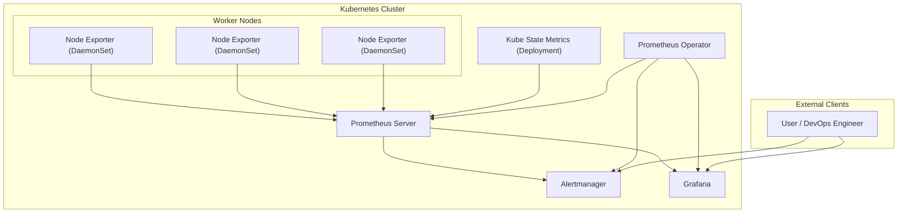

## Prometheus
Prometheus  is an open-source systems monitoring and alerting toolkit.

## What are metrics?
Metrics are numerical measurements in layperson terms. The term time series refers to the recording of changes over time. 
## Architecture
   

## Components
 ###  Prometheus Server
Prometheus server is the core of the monitoring system. It is responsible for scraping metrics from various configured targets, storing them in its time-series database (TSDB), and serving queries through its HTTP API.
Components: 
 - Retrieval: This module handles the scraping of metrics from endpoints, which are discovered either through static configurations or dynamic service discovery methods.
 - TSDB (Time Series Database): The data scraped from targets is stored in the TSDB, which is designed to handle high volumes of time-series data efficiently.
 - HTTP Server: This provides an API for querying data using PromQL, retrieving metadata, and interacting with other components of the Prometheus ecosystem.
 - Storage: The scraped data is stored on local disk (HDD/SSD) in a format optimized for time-series data.

### Service Discovery
Service discovery automatically identifies and manages the list of scrape targets (i.e., services or applications) that Prometheus monitors.
This is crucial in dynamic environments like Kubernetes where services are constantly being created and destroyed.
Components:
 - Kubernetes: In Kubernetes environments, Prometheus can automatically discover services, pods, and nodes using Kubernetes API, ensuring it monitors the most up-to-date list of targets.
 - File SD (Service Discovery): Prometheus can also read static target configurations from files, allowing for flexibility in environments where dynamic service discovery is not used.
### Pushgateway
The Pushgateway is used to expose metrics from short-lived jobs or applications that cannot be scraped directly by Prometheus.
These jobs push their metrics to the Pushgateway, which then makes them available for Prometheus to scrape(pull).
Use Case:
It's particularly useful for batch jobs or tasks that have a limited lifespan and would otherwise not have their metrics collected.
### Alertmanager
The Alertmanager is responsible for managing alerts generated by the Prometheus server.
It takes care of deduplicating, grouping, and routing alerts to the appropriate notification channels such as PagerDuty, email, or Slack.
### Exporters
Exporters are small applications that collect metrics from various third-party systems and expose them in a format Prometheus can scrape. They are essential for monitoring systems that do not natively support Prometheus.
Types of Exporters:Common exporters include
 - Node Exporter (for hardware metrics): Runs as a DaemonSet on every node.
 - MySQL Exporter (for database metrics)
 - kube-state-metrics: his service listens to the Kubernetes API to generate metrics about the state of objects like deployments, pods, and services.
   
### Prometheus Web UI
The Prometheus Web UI allows users to explore the collected metrics data, run ad-hoc PromQL queries, and visualize the results directly within Prometheus.
### Grafana
Grafana is a powerful dashboard and visualization tool that integrates with Prometheus to provide rich, customizable visualizations of the metrics data.
### API Clients
API clients interact with Prometheus through its HTTP API to fetch data, query metrics, and integrate Prometheus with other systems or custom applications.

## 📊 Prometheus Stack Architecture



### Prometheus Components

1. Prometheus Server = scrapes + stores metrics (TSDB +PomQL).  (pod -> prometheus-prometheus-kube-prometheus-prometheus-0)
2. Alertmanager = routes alerts. (pod -> alertmanager-prometheus-kube-prometheus-alertmanager-0)
3. Grafana = visualizes.  (pod -> prometheus-grafana-*)
4. Node Exporter / Kube State Metrics = provide metrics. ( pod for nodeExp (daemonset -> prometheus-prometheus-node-exporter-*) for Kubestate -> prometheus-kube-prometheus-operator-*)
4. Prometheus Operator = manages all of the above declaratively.   (Pod -> prometheus-kube-prometheus-operator*)
    It’s the “control plane” for the monitoring stack, not a metrics source itself.

### Accesing Gui
Port‑Forward Commands
#### Prometheus Server (prometheus-prometheus-kube-prometheus-prometheus-0)
  promtheus port 9090
```bash
kubectl port-forward prometheus-prometheus-kube-prometheus-prometheus-0 9090:9090
→ Access at: http://localhost:9090 (localhost in Bing)  
(Prometheus UI, PromQL query interface, TSDB status)
```
#### Alertmanager (alertmanager-prometheus-kube-prometheus-alertmanager-0)
 Port : 9093
```bash
kubectl port-forward alertmanager-prometheus-kube-prometheus-alertmanager-0 9093:9093
→ Access at: http://localhost:9093 (localhost in Bing)  
(Active alerts, silences, alert routing)
```
#### Grafana (prometheus-grafana-cdccd8f8f-bh84b)
Port 3000
```bash
kubectl port-forward prometheus-grafana-cdccd8f8f-bh84b 3000:3000
→ Access at: http://localhost:3000 (localhost in Bing)  
(Dashboards, visualization)
```
#### Kube State Metrics (prometheus-kube-state-metrics-df7468579-ssf4g)
Port 8080
```bash
kubectl port-forward prometheus-kube-state-metrics-df7468579-ssf4g 8080:8080
→ Access at: http://localhost:8080/metrics (localhost in Bing)  
(Cluster object metrics exposed for Prometheus)
```
#### Node Exporter (prometheus-prometheus-node-exporter-*)
Port 9100
```bash
kubectl port-forward prometheus-prometheus-node-exporter-nlgsw 9100:9100
→ Access at: http://localhost:9100/metrics (localhost in Bing)  
(Node‑level metrics: CPU, memory, disk, network)
```
