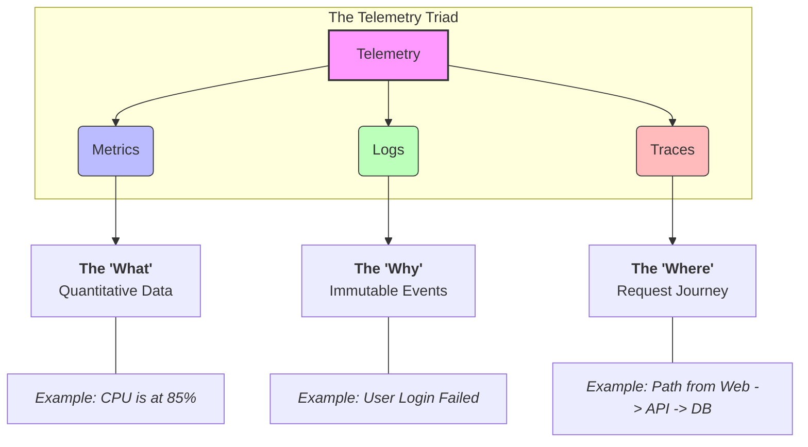

# Full-Stack Observability Guide
To achieve true visibility into a containerized infrastructure, you must capture the entire **Telemetry Triad**—Metrics, Logs, and Traces—across every layer of your stack.
## Repo Navigation
```
Observability/
├── 📊 Prometheus.md                      # Overview and components of Prometheus
├── 🌐 OpenTelemetry/                     # OpenTelemetry instrumentation and configs
├── 🕵️ Tracing-Jaeger/                    # Jaeger tracing implementation & folder structure
├── 📝 EFK/                               # Logging stack (Elasticsearch, Fluentd, Kibana)
│   └── log-generator-deployment.yaml     # Manifest for generating sample logs
├── 🛠️ Projt1-Instrumentation-Custom-Metric # Custom metrics instrumentation project
|    └──  # Application Instrumentation Guide & Demo
|    └── README.md  # application instrumentation notes
|
├── ☁️ Obervability/                      # Azure-specific observability
│   └── AKS-Cluseter-Prometheus-through-cli # AKS setup and Prometheus CLI guides
├── 🚀 Other-FullStack-ObservabiltyServices # Datadog, Dynatrace, and other integrations
└── 📜 README.md                          # Main documentation and setup guides
```

## Telemetry

---
## What to Monitor (Observability Sources)

To achieve full visibility into a containerized infrastructure, you must monitor three distinct layers of your stack. Each layer provides unique telemetry data necessary for understanding system health and troubleshooting failures.
```
┌─────────────────────────────────────────────────────────┐
│                  APPLICATION LAYER                      │
│  • METRICS: Latency, Error Rates, Custom Business KPIs  │
│  • LOGS: Application Exceptions, Contextual Stack Traces│
│  • TRACES: Distributed End-to-End Request Spans         │
└────────────────────────────┬────────────────────────────┘
                             │ Runs inside
                             ▼
┌─────────────────────────────────────────────────────────┐
│               KUBERNETES CLUSTER LAYER                  │
│  • METRICS: Pod Restarts, Scheduled vs. Actual Replicas │
│  • LOGS: Container stdout/stderr, K8s Event Streams     │
└────────────────────────────┬────────────────────────────┘
                             │ Hosted on
                             ▼
┌─────────────────────────────────────────────────────────┐
│                    HOST / NODE LAYER                    │
│  • METRICS: CPU, Memory, Disk I/O, Network Throughput   │
│  • LOGS: Syslog, Auth logs, Kernel/dmesg Events         │
└─────────────────────────────────────────────────────────┘

```
### 1. Host / Node Layer
The foundational physical or virtual machines running your entire cluster infrastructure.
*   **The Focus:** Ensuring the underlying hardware is healthy, stable, and has enough raw resource capacity to back your nodes.
*   **What you watch:** High-level infrastructure bottlenecks like CPU exhaustion, memory leakage, disk saturation, and dropped network packets.

### 2. Kubernetes Cluster Layer
The orchestration layer managing your container life cycles and scheduling.
*   **The Focus:** Ensuring the cluster state matches your desired configuration and the control plane is healthy.
*   **What you watch:** Pods stuck in crash loops, resource limit throttling, discrepancies between scheduled and actual replicas, and cluster API server latency.

### 3. Application Layer
The actual business logic and code microservices running inside the containers.
*   **The Focus:** Ensuring the end-user experience is fast, reliable, and functional.
*   **What you watch:** HTTP status codes (tracking 5xx/4xx errors), endpoint response times, application logs, and custom business metrics (e.g., login success rates or transaction volumes).
---
## 2. How to Monitor (Exporters & Collection Engines)

Depending on the type of telemetry, data is gathered using different collection patterns before being shipped to their respective backends.
```
              ┌─────────────────────────────────────┐
              │          TELEMETRY AGENTS           │
              └───────┬───────────┬───────────┬─────┘
                      │           │           │
       Pulls Metrics  │           │           │ Ships Traces
       (HTTP Scrape)  ▼           │           ▼ (OTLP/gRPC)
 ┌────────────────────────┐       │   ┌────────────────────────┐
 │   METRIC EXPORTERS     │       │   │   APPLICATION AGENT    │
 │ • Node Exporter (Host) │       │   │   • OpenTelemetry SDK  │
 │ • Kube-State-Metrics   │       │   │   • Jaeger Agent       │
 └────────────────────────┘       │   └────────────────────────┘
                                  │
                     Streams Logs │ (Tail files)
                                  ▼
                      ┌──────────────────────┐
                      │  LOG SHIPPERS / FLX  │
                      │ • Fluent Bit / Loki  │
                      │ • Promtail           │
                      └──────────────────────┘
```
### Metric Collectors (Pull-Based)
Prometheus collects metrics using a **pull model**, meaning it scrapes data from HTTP endpoints (usually `/metrics`).
*   **Node Exporter:** Runs directly on the host machine (or as a `DaemonSet` on every node). It queries the host's Linux kernel (via `/proc` and `/sys`) to gather hardware and OS-level statistics like `node_cpu_seconds_total`.
*   **kube-state-metrics (KSM):** Listens directly to the Kubernetes API server and generates metrics about the state of objects (Deployments, Pods, Nodes). It exposes health indicators like `kube_pod_status_phase`.

### Log Forwarders (Push-Based Streams)
Unlike metrics, logs are event-driven strings generated constantly by application code and system daemons. They must be actively streamed out.
*   **Log Shippers (Fluent Bit / Promtail):** Run as a `DaemonSet` on every Kubernetes node. They tail container logs directly from the host storage (`/var/log/pods`), enrich them with cluster metadata (Namespace, Pod Name, Container Name), and ship them to a central log engine.

### Distributed Tracing (Code Instrumentation)
Traces require application code awareness to track user contexts across microservice boundaries.
*   **OpenTelemetry (OTel) SDKs:** Integrated directly into backend source code. When an endpoint is hit, the SDK instantiates a "Trace ID". As the app calls downstream APIs or databases, this ID is passed along inside the network headers, generating timestamped code path records called "Spans".

---

## 3. Where the Data Goes (Storage & Visualization)

Once the telemetry data leaves your infrastructure, it is processed, indexed by dedicated storage backends, and unified into Grafana.
```
┌─────────────────┐      Metrics      ┌──────────────────┐
│ METRIC SOURCES  ├──────────────────>│ PROMETHEUS TSDB  │─────┐
└─────────────────┘                   └──────────────────┘     │
┌─────────────────┐       Logs        ┌──────────────────┐     │ PromQL
│   LOG SOURCES   ├──────────────────>│   GRAFANA LOKI   │─────┼───> ┌────────────────────┐
└─────────────────┘                   └──────────────────┘     │     │ GRAFANA DASHBOARDS │
┌─────────────────┐      Traces       ┌──────────────────┐     │     │(Unified Monitoring)│
│  TRACE SOURCES  ├──────────────────>│  TEMPO / JAEGER  │─────┘     └────────────────────┘
└─────────────────┘                   └──────────────────┘ LogQL / TraceQL
```
### LGTM Stack Full Grafana Onservabilty stack (Metric+Log+Tracees)
(Loki, Grafana, Tempo, and Mimir)
- Grafana Mimir (The "M" in LGTM) — Metrics
- Grafana Tempo (The "T" in LGTM) — Traces
- Loki - Logs
    
### The Storage Backends
*   **Prometheus Engine:(Metric)** Stores metrics inside a custom Time Series Database (TSDB). Data is saved sequentially over time, enabling rapid trend calculations via **PromQL**.
*   **Grafana Loki Engine:(logging)** A lightweight log aggregation system that only indexes metadata labels (like `app="auth"`), keeping storage costs low and search query speeds via **LogQL** incredibly fast.
*   **Jaeger / Grafana Tempo:(Tracing)** Distributed tracing storage systems optimized for mapping high-volume transaction dependencies and tracking microservice latency timelines.

#####  Unification Layer: Grafana (In the above stack)
- Grafana serves as the single pane of glass. By cross-referencing your metadata labels across Prometheus, Loki, and Tempo, you can look at a metric error spike on a dashboard panel, click on the anomaly, immediately pull up the corresponding **Logs** for that millisecond, and pivot straight into a **Trace** to find the exact broken line of code.
---
### Loging Stack
centralized log management
all three stacks (Loki, ELK, and EFK)
1. **Grafana Logging Stack-Loki Stack**: Part of Grafana LGTM Stack—Loki, Grafana, Tempo, Mimir).
   Grafana Alloy (The Collector) + Grafana Loki (The Storage/Database) + Grafana (The Visualization)
    (Promtail old one- Alloy new)
2.  The **ELK Stack** ( Elastic Search + Logstash + Kibana )

3. The **EFK Stack** (  Elastic Search + Fluentbit + Kibana )

### Flow Diagram
 ##### 1. The Loki Stack (ALG / PLG)
Focused on metadata indexing. Highly compressed, low CPU/RAM overhead.
```
[ Pod / Stdout ] 
         │
         ▼ (Writes to host node)
  [ /var/log/pods/ ] <───── (Tails log files)
         │
         ▼
  [ Grafana Alloy ]       <─ Adds K8s metadata labels 
         │                   (e.g., namespace="default")
         ▼ (HTTP Push)
  [ Grafana Loki ]        <─ Indexes ONLY the labels.
         │                   Compresses raw log text into chunks.
         ▼ (Object Storage)
  [ MinIO / AWS S3 ]      <─ Cheap object storage tier
         │
         ▼ (LogQL)
  [  Grafana UI  ]
```
##### 2. The ELK Stack
Heavyweight full-text indexing pipeline. Fast searching across billions of words but expensive on resources
```
[ Pod / Stdout ] 
         │
         ▼ 
  [ /var/log/pods/ ] <───── (Tails log files)
         │
         ▼
  [   Filebeat   ]        <─ Lightweight shipper agent on the node
         │
         ▼ (Lumberjack Protocol)
  [   Logstash   ]        <─ Heavy processing engine. Aggregates, 
         │                   parses JSON, mutates data, structures fields.
         ▼ (Bulk API HTTP)
  [ Elasticsearch]        <─ Creates an Inverted Index of *every single word* 
         │                   in the log. Requires high RAM/CPU.
         ▼ (Block Storage)
  [ SSDs / NVMe  ]        <─ High-speed storage required for indexes
         │
         ▼ (Lucene Query)
  [  Kibana UI   ]
```
##### 3. The EFK Stack
The Kubernetes variant of ELK. Replaces Logstash with Fluentd or Fluent Bit to optimize node performance.
```
[ Pod / Stdout ] 
         │
         ▼ 
  [ /var/log/pods/ ] <───── (Tails log files)
         │
         ▼
  [  Fluent Bit  ]        <─ Tiny C-based collector running as a DaemonSet
         │
         ▼ (Forward Protocol)
  [   Fluentd    ]        <─ Ruby-based central aggregator (Optional: filters
         │                   and parses logs instead of heavy Logstash)
         ▼ (Bulk API HTTP)
  [ Elasticsearch]        <─ Processes full-text indexing
         │
         ▼
  [  Kibana UI   ]
```
 | **Role**                  | **In the Loki Stack**                          | **In the ELK / EFK Stack**                     |
|----------------------------|-----------------------------------------------|-----------------------------------------------|
| **The Visualizer (UI)**    | Grafana                                       | Kibana                                        |
| **The Database (Storage)** | Loki                                          | Elasticsearch                                 |
| **The Node Collector (Agent)** | Alloy (or Promtail)                        | Filebeat (ELK) / Fluent Bit (EFK)             |
| **The Central Parser (Optional)** | (None — Alloy sends straight to Loki)   | Logstash (ELK) / Fluentd (EFK)                |
---

### Distributed Tracing Stack
```
[ Application ]  ➡️  [ OTel Collector ]  ➡️  [ Trace Database ]  ➡️  [ Visualization ]
  (Instrumented         (Receives, filters       (Grafana Tempo /       (Grafana / Jaeger UI)
   with OTel SDK)        & batches spans)         Jaeger Backend)
```
1. The Instrumentation Layer (The Generators) : OpenTelemetry (OTel) SDK
2. The Collection & Routing Layer (The Pipeline) : OpenTelemetry Collector or Grafana Alloy
3. The Storage Backend (The Database) : Grafana Tempo , Jaeger Backend
4. The Visualization Layer (The UI) :  Grafana, Jaeger UI

Modern Gold_standard tracing Stack

$$\text{OpenTelemetry SDK (App Code)} \longrightarrow \text{OTel Collector} \longrightarrow \text{Grafana Tempo} \longrightarrow \text{Grafana UI}$$

##  Prometheus : How to Monitor : (Exporters & Collection)

Prometheus collects metrics using a **pull model**, meaning it scrapes data from HTTP endpoints (usually `/metrics`). Because most infrastructure components and applications don't expose metrics in a Prometheus-compatible format natively, we use **Exporters** to translate internal data into a readable format.
  
```
┌─────────────────────────────────────────────────────────┐
│                   PROMETHEUS SERVER                     │
│          (Pulls data via HTTP GET /metrics)             │
└───────┬────────────────────┬────────────────────┬───────┘
        │                    │                    │
        │ Scrapes            │ Scrapes            │ Scrapes
        ▼                    ▼                    ▼
┌───────────────┐    ┌───────────────┐    ┌───────────────┐
│ Node Exporter │    │  kube-state-  │    │  Application  │
│               │    │    metrics    │    │   (OTel SDK)  │
└───────┬───────┘    └───────┬───────┘    └───────┬───────┘
        │ Reads              │ Reads              │ Exposes
        ▼                    ▼                    ▼
┌───────────────┐    ┌───────────────┐    ┌───────────────┐
│  Host Machine │    │  K8s Cluster  │    │ App Internals │
│ (CPU, Mem, IO)│    │ (Pod/SVC State)│   │ (Routes, Errs)│
└───────────────┘    └───────────────┘    └───────────────┘
```


### 1. Monitoring the Host: Node Exporter
The **Node Exporter** is an official Prometheus agent that runs directly on the host machine (or as a `DaemonSet` on every node in a Kubernetes cluster).
*   **How it works:** It queries the host's Linux kernel (via `/proc` and `/sys`) to gather hardware and OS-level statistics.
*   **What it exposes:** Standard metrics like `node_cpu_seconds_total`, `node_memory_MemAvailable_bytes`, and disk I/O metrics.

### 2. Monitoring the Cluster: kube-state-metrics (KSM)
Kubernetes components do not naturally format cluster-wide deployment configurations into Prometheus metrics. **kube-state-metrics** resolves this.
*   **How it works:** It listens directly to the Kubernetes API server and generates metrics about the state of objects (Deployments, Pods, Nodes, CronJobs). 
*   **What it exposes:** Crucial health metrics like `kube_pod_status_phase` (to catch Pending/Failed pods) or `kube_deployment_spec_replicas`.

### 3. Monitoring the Application: Custom Instrumentation & OpenTelemetry
To monitor inside the application, your code needs to actively measure its own performance and expose those variables.
*   **How it works:** Developers integrate an **OpenTelemetry SDK** or a Prometheus Client Library directly into their backend code (Node.js, Python, Go, Java, etc.). 
*   **What it exposes:** Exact application behaviors, such as incoming HTTP request counts (`http_requests_total`), runtime memory heap usage, or custom KPIs like active checkouts or order values.
---
## Where the Data Goes (Storage & Visualization)

Once the telemetry data is exposed by exporters, it follows a structured pipeline: collected by Prometheus for storage and querying, and then visualized dynamically inside Grafana.
```
┌──────────────────────┐      Scrapes       ┌──────────────────────┐
│    DATA SOURCES      ├───────────────────>│  PROMETHEUS SERVER   │
│ (Node, KSM, App SDK) │                    │ (TSDB / Time Series) │
└──────────────────────┘                    └──────────┬───────────┘
        │
        │ PromQL Queries
        ▼
┌──────────────────────┐
│  GRAFANA DASHBOARDS  │
│ (Visuals & Alerting) │
└──────────────────────┘
```
### 1. The Storage Engine: Prometheus TSDB
When Prometheus pulls metrics from your exporters, it stores them inside a custom **Time Series Database (TSDB)**.
*   **How it saves data:** Instead of traditional tables, metrics are saved as sequential data points over time. Each point consists of a timestamp and a numeric value, indexed by metric names and key-value labels (e.g., `http_requests_total{status="500", service="payment"}`).
*   **Data Retention:** By default, Prometheus is designed for short-to-medium term storage (usually 15 days). For long-term historical analysis, it can be configured to ship data to remote storage engines like Thanos or Cortex.

### 2. The Query Language: PromQL
To extract meaning from the raw data stored in the TSDB, Prometheus uses **PromQL (Prometheus Query Language)**. 
*   PromQL allows you to filter metrics by specific labels, calculate rates of change over time, and aggregate statistics across multiple nodes or pods simultaneously.
*   *Example:* `sum(rate(http_requests_total[5m])) by (status)` calculates the per-second rate of HTTP requests over the last 5 minutes, grouped by HTTP status code.

### 3. The Visualization Layer: Grafana
While Prometheus provides a basic expression browser to test queries, **Grafana** is the industry standard for production visualization.
*   **The Connection:** Grafana connects to Prometheus as a *Data Source*. It runs PromQL queries in the background on a loop to refresh graphs, charts, heatmaps, and gauges in real time.
*   **Dashboards & Panels:** Individual teams construct clean dashboards aggregating different metric layers—allowing engineers to spot an anomaly at the application layer and immediately trace it down to cluster or host constraints on a single screen.


  
